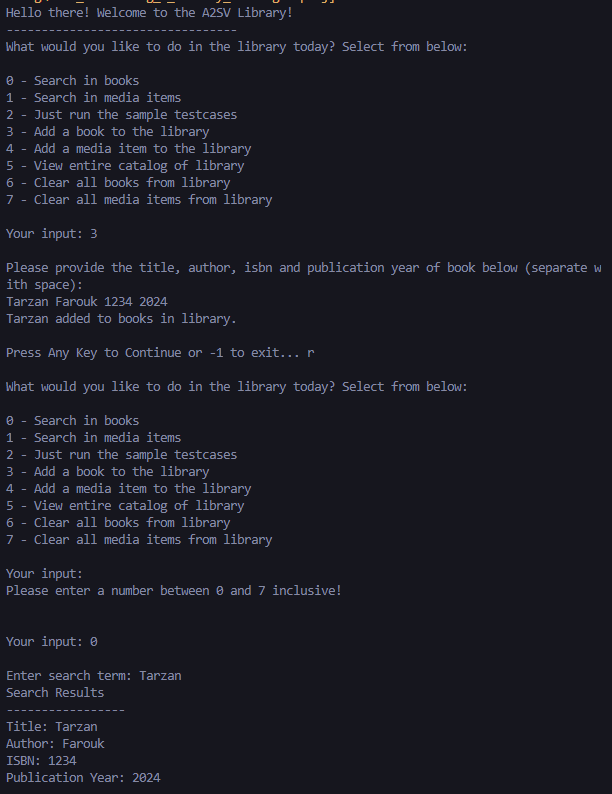

# Library Catalog System in C#

This project implements a simple library catalog system using object-oriented programming concepts in C#. The system consists of classes representing a `Library`, `Book`, and `MediaItem` (DVD or CD), along with methods to manage and display the catalog of the library.

## Classes Implemented

### `Library` Class

- **Properties**
  - `Name` (string): The name of the library.
  - `Address` (string): The address of the library.
  - `Books` (List of `Book`): A list to store all the books in the library.
  - `MediaItems` (List of `MediaItem`): A list to store all the media items in the library.
  
- **Methods**
  - `AddBook(Book book)`: Adds a book to the library's collection.
  - `RemoveBook(Book book)`: Removes a book from the library's collection.
  - `AddMediaItem(MediaItem item)`: Adds a media item to the library's collection.
  - `RemoveMediaItem(MediaItem item)`: Removes a media item from the library's collection.
  - `PrintCatalog()`: Prints the list of books and media items in the library.

### `Book` Class

- **Properties**
  - `Title` (string): The title of the book.
  - `Author` (string): The author of the book.
  - `ISBN` (string): The ISBN (International Standard Book Number) of the book.
  - `PublicationYear` (int): The publication year of the book.

### `MediaItem` Class

- **Properties**
  - `Title` (string): The title of the media item.
  - `MediaType` (string): The type of the media item (e.g., DVD, CD).
  - `Duration` (int): The duration of the media item in minutes.

## Features Implemented

- **Adding and Removing Items**
  - Methods to add and remove books and media items from the library's collection.

- **Catalog Display**
  - Method to print the catalog of the library, showing details of all books and media items.

- **Search Feature**
  - Implement a search method that allows users to search for books or media items by title, author, ISBN, or media type.

