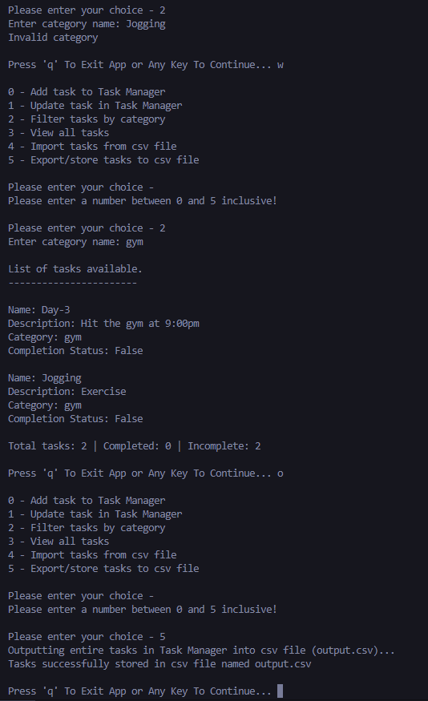

## Simple Task Manager Application

### Objective

This project is a beginner-friendly application developed in C# to practice fundamental concepts including enums, object initializers, lambda expressions, asynchronous programming, and exception handling within a manageable project.

### Description

The Simple Task Manager is a console-based application designed for task management. Users can interact with the application to add tasks, view task lists, and filter tasks based on categories. The implementation demonstrates the use of enums to categorize tasks, object initializers for creating Task objects, lambda expressions for task filtering, asynchronous programming for file operations, and robust exception handling.

### Features

1. **Enumerated Task Categories**
   - Created an enum to represent different task categories like Personal, Work, Errands, etc.

2. **Task Class with Object Initializers**
   - Defined a Task class with properties: Name, Description, Category (using the enum), and IsCompleted.
   - Utilized object initializers for convenient creation and initialization of Task objects.

3. **Task Manager Operations**
   - Implemented methods to add new tasks to the Task Manager.
   - Provided functionality to display a list of tasks with details including name, description, category, and completion status.

4. **Lambda Expression Filtering**
   - Added options to view tasks based on categories (e.g., Work tasks or Personal tasks).
   - Employed lambda expressions to filter and display tasks based on selected categories.

5. **Asynchronous File Operations**
   - Used asynchronous programming to store tasks in a CSV file (writing).
   - Utilized async/await pattern to read task data from the file asynchronously when the application starts.

6. **Exception Handling**
   - Implemented robust exception handling to manage file-related exceptions during read and write operations.
   - Ensured proper validation and handling of user input to enhance application stability.

### Implementation Overview

1. **Task Enum**
   - Defined an enum `TaskCategory` to represent various task categories.

2. **Task Class**
   - Created a `Task` class with properties:
     - `Name` (string)
     - `Description` (string)
     - `Category` (TaskCategory enum)
     - `IsCompleted` (bool)

3. **Task Manager**
   - Developed a `TaskManager` class responsible for:
     - Adding tasks
     - Displaying task details
     - Filtering tasks using lambda expressions

4. **Asynchronous File Operations**
   - Implemented file I/O operations using asynchronous methods:
     - Writing tasks to a CSV file
     - Reading tasks from the CSV file asynchronously at startup

5. **Exception Handling**
   - Implemented try-catch blocks to handle exceptions during file operations and input validation.

### Conclusion

The Simple Task Manager application is an educational project that integrates multiple concepts of C# programming. It provides a practical approach to learning enums, object initialization, lambda expressions, asynchronous programming, and exception handling within the context of a task management system. The project aims to improve proficiency in these concepts while creating a functional and user-friendly application.
