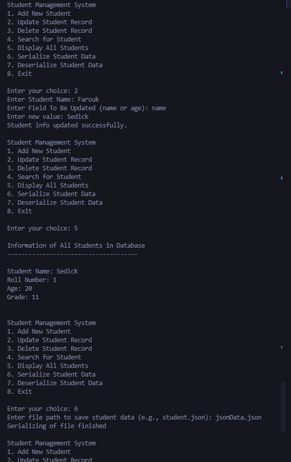

# Student List Management System

This project implements a generic class `StudentList<T>` for managing a collection of `Student` objects. The `StudentList<T>` class provides functionality to add, search, update, delete, display, serialize, and deserialize student data. This README provides an overview of the class structure and usage instructions.

## Project Structure

- **`StudentList<T>` Class**: Defines a generic class for managing a list of `Student` objects.
- **`Student` Class**: Represents a student entity with properties like Name, Age, StudentId, and Grade.
- **`Program.cs` (not shown)**: Contains the entry point of the application for demonstrating the usage of `StudentList<T>`.

## `StudentList<T>` Class (`StudentList.cs`)

The `StudentList<T>` class is designed to work with any type `T` that inherits from the `Student` class. It provides the following methods:

- **`Add(T student)`**: Adds a new student to the list.
- **`Search(string term, string key = "")`**: Searches for students by name or student ID (RollNumber) and allows optional sorting by name or age.
- **`UpdateStudentInfo(string name, string field, string term)`**: Updates student information (name, age, or grade) based on the provided criteria.
- **`DeleteStudent(string term)`**: Deletes a student from the list based on the search term (name or student ID).
- **`DisplayStudents()`**: Displays information of all students in the database.
- **`Serialize(string file)`**: Serializes the list of students to a JSON file specified by the file path.
- **`Deserialize(string file)`**: Deserializes student data from a JSON file specified by the file path.
